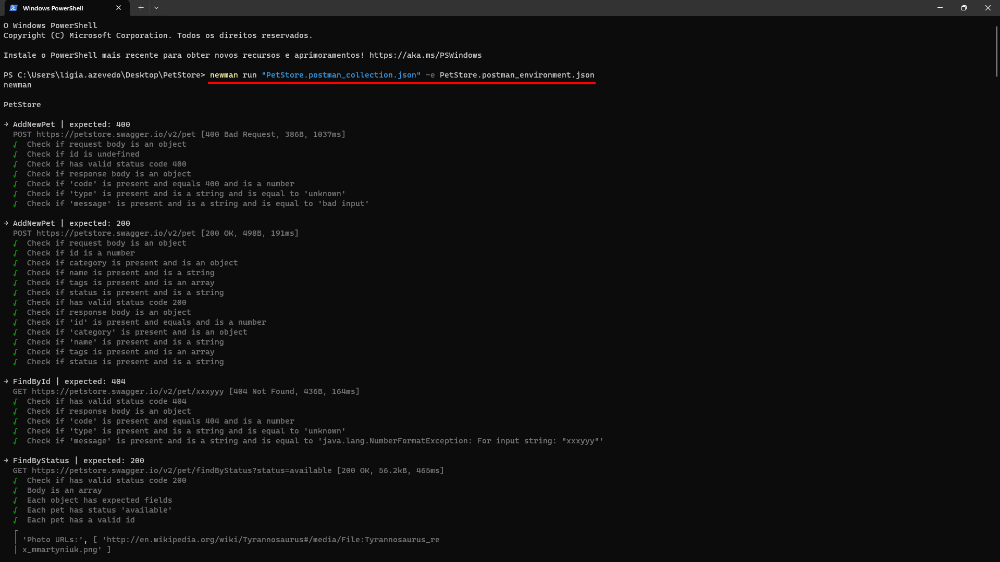
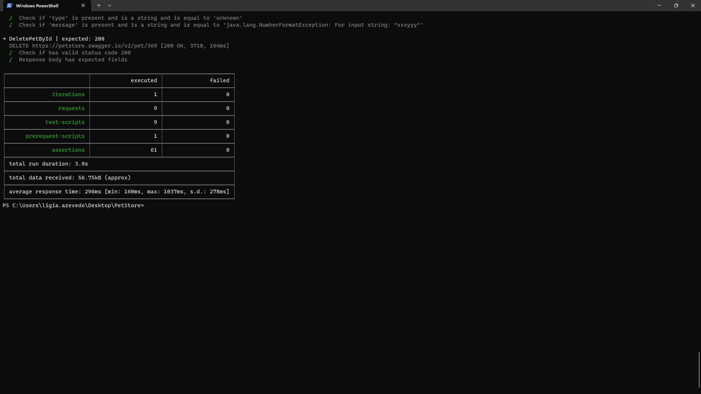
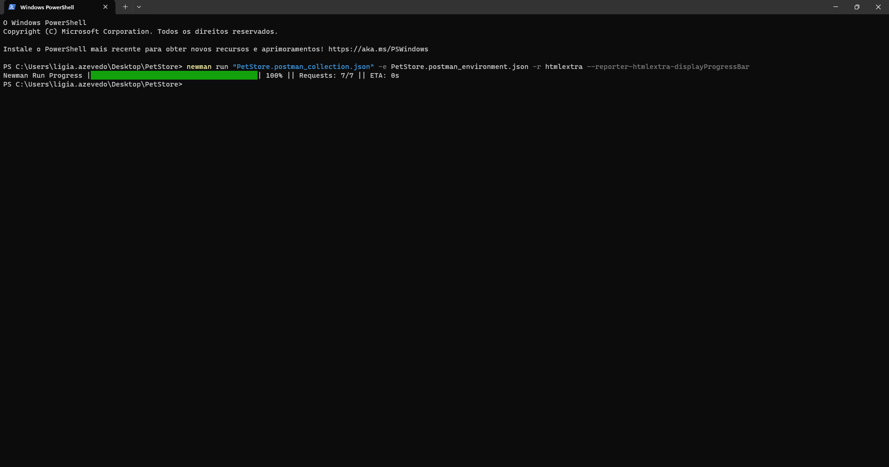
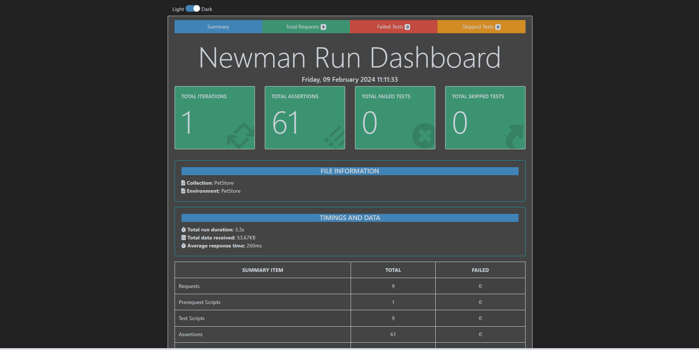
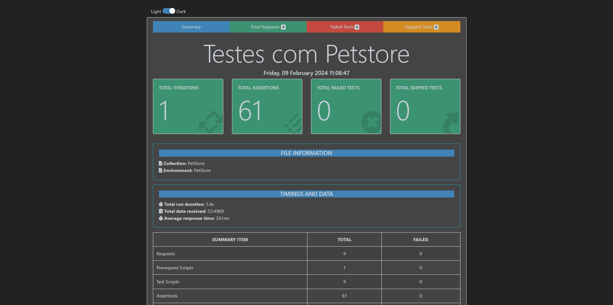

## **⚠️ Description**

Esse projeto é um template para testes utilizando as ferramentas Postman e Newman.

## **📚 Resources**

Apresenta um CRUD utilizando o Swagger [Petstore](https://petstore.swagger.io/#/) para posterior execução da ferramenta Newman via CLI (terminal)

## ✔️ **Pet Methods**

CRUD utilizando o Swagger [Petstore](https://petstore.swagger.io/#/):


<table>
  <tr>
    <th><b>METHOD</b></th>
    <th>ENDPOINT</th>
    <th>DESCRIPTION</th>
    <th>SCOPE</th>
  </tr>
  <tr>
    <td><b>POST</b></td>
    <td>/petstore.swagger.io/v2/pet</td>
    <td>Cria um novo pet para a loja</td>
    <td>REQUEST</td>
  </tr>
  <tr>
    <td><b>GET</b></td>
    <td>/petstore.swagger.io/v2/pet/findByStatus</td>
    <td>Lista os pets pelo status</td>
    <td>REQUEST</td>
  </tr>
  <tr>
    <td><b>GET</b></td>
    <td>/petstore.swagger.io/v2/pet/{petId}</td>
    <td>Lista o pet pelo Id</td>
    <td>REQUEST</td>
  </tr>
  <tr>
    <td><b>PUT</b></td>
    <td>/petstore.swagger.io/v2/pet</td>
    <td>Atualiza um pet específico pelo Id</td>
    <td>REQUEST</td>
  </tr>
  <tr>
    <td><b>DELETE</b></td>
    <td>/petstore.swagger.io/v2/pet/{petId}</td>
    <td>Remove um pet específico pelo Id</td>
    <td>REQUEST</td>
  </tr>
</table>


## **⚡ Getting Started**

**Instalar o Node.js localmente:**

• [Node.js](https://nodejs.org/en)


**Salvar a collection e environment na mesma pasta:**

PetStore.postman_collection

PetStore.postman_environment


**Instalar o Newman:**
```
npm install -g newman
```

**Instalar Gerar Relatórios:**
```
npm install -g newman-reporter-htmlextra
```

**Executar:** 
```
newman run "PetStore.postman_collection.json" -e PetStore.postman_environment.json
```

**Gerar Relatório de Testes:** 
```
newman run "PetStore.postman_collection.json" -e PetStore.postman_environment.json -r htmlextra --reporter-htmlextra-displayProgressBar
```

**Mudar o Título do Relatório de Testes:**
```
newman run "PetStore.postman_collection.json" -e PetStore.postman_environment.json -r htmlextra --reporter-htmlextra-displayProgressBar --reporter-htmlextra-title "Testes com Petstore"
```

## **🎯Resultados Obtidos:**

**Após execução da ferramenta Newman via CLI (terminal) - Parte I:**


**Após execução da ferramenta Newman via CLI (terminal) - Parte II:**


**Após execução da ferramenta Newman via CLI (terminal) Gerar Relatório de Testes:**


**Relatório de Testes salvo automaticamente em formato .html onde estão salvos a collection e o environment:**


**Relatório de Testes salvo automaticamente em formato .html onde estão salvos a collection e o environment após execução do comando Mudando o Título do Relatório de Testes:**


